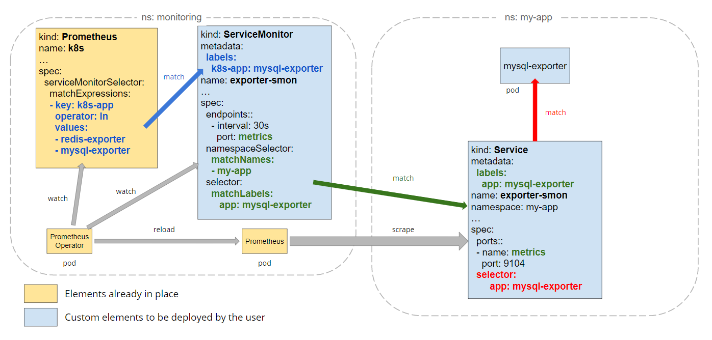

# Custom Metrics Operator

The Custom Metrics Operator automatically binds ServiceMonitor resource to the Prometheus server.

# Design
The Operator automatically updates `serviceMonitorSelector` once the ServiceMonitor resource is deployed.

# Deployment

## Prerequisites

- prometheus operator has been deployed
- prometheuses crd instance exists

## Running

Build the binary: 

`make`

## Flags

flag | description
------------ | -------------
prometheus | The name of Prometheus resource to which ServiceMonitor resources are bound
prometheus-namespace | The namespace of Prometheus resource
ignored-namespaces| Ignore ServiceMonitor resources in specified namespaces. Split namespaces by comma
servicemonitor-label| The label key that must match the field serviceMonitorSelector of Prometheus resources
servicemonitor-namespace-label| The label key of ServiceMonitor namespace